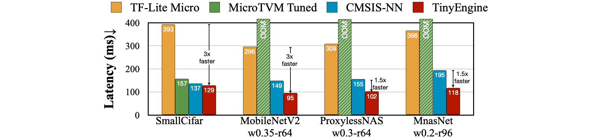
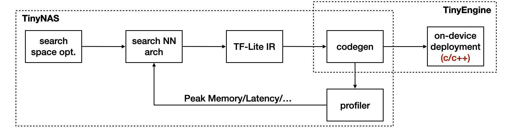

# MCUNet: Tiny Deep Learning on IoT Devices  [[Website]](http://mcunet.mit.edu/) [[arXiv]](https://arxiv.org/abs/2007.10319)[[Demo]](https://www.youtube.com/watch?v=YvioBgtec4U&feature=emb_logo)

```
@article{lin2020mcunet,
  title={Mcunet: Tiny deep learning on iot devices},
  author={Lin, Ji and Chen, Wei-Ming and Lin, Yujun and Gan, Chuang and Han, Song},
  journal={Advances in Neural Information Processing Systems},
  volume={33},
  year={2020}
}
```


**[News]** This repo is still under development. Please check back for the updates!

<p align="center">
  
</p>

<p align="center"><a href="https://news.mit.edu/2020/iot-deep-learning-1113">[MIT News]</a> System brings deep learning to “internet of things” devices</p>

* [Overview](#overview)
* [Framework Structure](#framework-structure)
* [Model Zoo](#model-zoo)
   * [ImageNet models](#imagenet-models)
      * [Comparison on STM32F746 (constraints: 320kB SRAM, 1MB Flash)](#comparison-on-stm32f746-constraints-320kb-sram-1mb-flash)
      * [MCUNet under different memory constraints](#mcunet-under-different-memory-constraints)
         * [1. Int8 Models](#1-int8-models)
         * [2. Int4 models](#2-int4-models)
      * [MCUNet under different latency constraints](#mcunet-under-different-latency-constraints)
   * [VWW &amp; Speech Command models](#vww--speech-command-models)
* [Testing](#testing)
* [Code Cleaning Plan](#code-cleaning-plan)
* [Requirement](#requirement)
* [Acknowledgement](#acknowledgement)
* [Related Projects](#related-projects)

## Overview

Microcontrollers are low-cost, low-power hardware. They are widely deployed and have wide applications.


But the tight memory budget (50,000x smaller than GPUs) makes deep learning deployment difficult.


MCUNet is a **system-algorithm co-design** framework for tiny deep learning on microcontrollers. It consists of **TinyNAS** and **TinyEngine**. They are co-designed to fit the tight memory budgets.

With system-algorithm co-design, we can significantly improve the deep learning performance on the same tiny memory budget.


Our **TinyEngine** inference engine could be a useful infrastructure for MCU-based AI applications. It significantly **improves the inference speed and reduces the memory usage** compared to existing libraries like [TF-Lite Micro](https://www.tensorflow.org/lite/microcontrollers), [CMSIS-NN](https://arxiv.org/abs/1801.06601), [MicroTVM](https://tvm.apache.org/2020/06/04/tinyml-how-tvm-is-taming-tiny), etc.

- TinyEngine improves the **inference speed** by **1.5-3x**




- TinyEngine reduces the **peak memory** by **2.7-4.8x**


## Framework Structure

The structure of the MCUNet implementation is as follows. The whole project is mostly based on a Python implementation, except for the device side deployment. 
TinyEngine and TinyNAS share the code of Code Generation, which is used for memory profiling during architecture search, and also the first step for device deployment.




## Model Zoo

We provide the searched models for ImageNet, Visual Wake Words (VWW), and Google Speech Commands for comparison. The statistics on TF-Lite Micro and TinyEngine is based on *int8 quantized* version of the model (unless otherwise stated).

- **Inference engines**: we compared both [TF-Lite Micro](https://www.tensorflow.org/lite/microcontrollers) and <u>TinyEngine</u> for the on-device statistics. 
- **Model formats**: we provide the model in both PyTorch floating-point format (with <u>json</u> definition of architecture and checkpoint (<u>ckpt</u>) for weights) and also TF-Lite int8 quantized format (<u>tflite</u>)
- **Statistics**: we include
  - model statistics: computation (MACs), #parameters (Param), theoretial peak activation size (Act) (by summing input and output activation)
  - deployment statistics: peak SRAM usage (SRAM), Flash usage (Flash)

We provide download links in the following tables. Alternatively, you can download all the checkpoints and tf-lite files at once by running:

```bash
python jobs/download_all_models.py
```


### ImageNet models

#### Comparison on STM32F746 (constraints: 320kB SRAM, 1MB Flash)

We first compare the baseline networks (scaled MobileNetV2, <u>MbV2-s</u> and scaled ProxylessNASMobile, <u>Proxyless-s</u>) with MCUNet on STM32F746. The baseline networks are scaled to fit the hardware constraints (we compoundly scale the width and resolution of the baseline networks and report the best accuracy under the constraints).

The latency and memory usage are measured on STM32F746 board. TinyEngine can reduce the Flash and SRAM usage and fit a larger model; TinyNAS can design network that has superior accuracy under the same memory budget.

| Model                                             | Model Stats.                                   | TF-Lite Stats.                                    | TinyEngine Stats.                                  | Top-1 Acc.                  | Top-5 Acc.                 | Link                                                         |
| ------------------------------------------------- | ---------------------------------------------- | ------------------------------------------------- | -------------------------------------------------- | --------------------------- | -------------------------- | ------------------------------------------------------------ |
| MbV2-s <br />for TF-Lite<br />(w0.3-r80)          | MACs: 7.3M<br />Param: 0.63M<br />Act: 94kB    | SRAM: 306kB<br />Flash: 943kB<br />Latency: 445ms | SRAM: 98kB<br />Flash: 745kB<br />Latency: 124ms   | FP: 39.3%<br />int8: 38.6%  | FP: 64.8%<br />int8: 64.1% | [json](assets/configs/mbv2-w0.3-r80_imagenet.json)<br />[ckpt](https://hanlab.mit.edu/projects/tinyml/mcunet/release/mbv2-w0.3-r80_imagenet.pth)<br />[tflite](https://hanlab.mit.edu/projects/tinyml/mcunet/release/mbv2-w0.3-r80_imagenet.tflite) |
| MbV2-s <br />for TinyEngine<br />(w0.35-r144)     | MACs: 23.5M <br />Param: 0.75M<br />Act: 303kB | SRAM: 646kB<br />Flash: 1060kB<br />Latency: OOM  | SRAM: 308kB<br />Flash: 862kB<br />Latency: 393ms  | FP: 49.7%<br />int8: 49.0%  | FP: 74.6%<br />int8: 73.8% | [json](assets/configs/mbv2-w0.35-r144_imagenet.json)<br />[ckpt](https://hanlab.mit.edu/projects/tinyml/mcunet/release/mbv2-w0.3-r80_imagenet.pth)<br />[tflite](https://hanlab.mit.edu/projects/tinyml/mcunet/release/mbv2-w0.35-r144_imagenet.tflite) |
|                                                   |                                                |                                                   |                                                    |                             |                            |                                                              |
| Proxyless-s <br />for TF-Lite<br />(w0.25-r112)   | MACs: 10.7M <br />Param: 0.57M<br />Act: 98kB  | SRAM: 288kB<br />Flash: 860kB<br />Latency: 660ms | SRAM: 114kB<br />Flash: 701kB<br />Latency: 169ms  | FP: 44.9%<br />int8: 43.8%  | FP: 70.0%<br />int8: 69.0% | [json](assets/configs/proxyless-w0.25-r112_imagenet.json)<br />[ckpt](https://hanlab.mit.edu/projects/tinyml/mcunet/release/proxyless-w0.25-r112_imagenet.pth)<br />[tflite](https://hanlab.mit.edu/projects/tinyml/mcunet/release/proxyless-w0.25-r112_imagenet.tflite) |
| Proxyless-s <br />for TinyEngine<br />(w0.3-r176) | MACs: 38.3M <br />Param: 0.75M<br />Act: 242kB | SRAM: 526kB<br />Flash:  1063kB<br />Latency: OOM | SRAM: 292kB<br />Flash: 892kB<br />Latency: 572ms  | FP: 57.0%<br />int8:  56.2% | FP: 80.2%<br />int8: 79.7% | [json](assets/configs/proxyless-w0.3-r176_imagenet.json)<br />[ckpt](https://hanlab.mit.edu/projects/tinyml/mcunet/release/proxyless-w0.3-r176_imagenet.pth)<br />[tflite](https://hanlab.mit.edu/projects/tinyml/mcunet/release/proxyless-w0.3-r176_imagenet.tflite) |
|                                                   |                                                |                                                   |                                                    |                             |                            |                                                              |
| TinyNAS<br />for TinyEngine<br />(**MCUNet**)     | MACs: 81.8M <br />Param: 0.74M<br />Act: 333kB | SRAM: 560kB<br />Flash:  1088kB<br />Latency: OOM | SRAM: 293kB<br />Flash: 897kB<br />Latency: 1075ms | FP: 62.2%<br />int8:  61.8% | FP: 84.5%<br />int8: 84.2% | [json](assets/configs/mcunet-320kb-1mb_imagenet.json)<br />[ckpt](https://hanlab.mit.edu/projects/tinyml/mcunet/release/mcunet-320kb-1mb_imagenet.pth)<br />[tflite](https://hanlab.mit.edu/projects/tinyml/mcunet/release/mcunet-320kb-1mb_imagenet.tflite) |

#### MCUNet under different memory constraints

We provide the MCUNet models under different memory constraints:

- STM32 F412 (Cortex-M4, 256kB SRAM/1MB Flash)
- STM32 F746 (Cortex-M7, 320kB SRAM/1MB Flash)
- STM32 H743 (Cortex-M7, 512kB SRAM/2MB Flash)

The memory usage and latency are measured on the corresponding devices.

##### 1. Int8 Models

Int8 quantization is the most widely used quantization and default setting in our experiments.

| Constraints    | Model Stats.                                   | TF-Lite Stats.                                    | TinyEngine Stats.                                  | Top-1 Acc.                  | Top-5 Acc.                 | Link                                                         |
| -------------- | ---------------------------------------------- | ------------------------------------------------- | -------------------------------------------------- | --------------------------- | -------------------------- | ------------------------------------------------------------ |
| 256kB<br />1MB | MACs: 67.3M <br />Param: 0.73M<br />Act: 325kB | SRAM: 546kB<br />Flash:  1081kB<br />Latency: OOM | SRAM: 242kB<br />Flash: 878kB<br />Latency: 3535ms | FP: 60.9%<br />int8: 60.3%  | FP: 83.3%<br />int8: 82.6% | [json](assets/configs/mcunet-256kb-1mb_imagenet.json)<br />[ckpt](https://hanlab.mit.edu/projects/tinyml/mcunet/release/mcunet-256kb-1mb_imagenet.pth)<br />[tflite](https://hanlab.mit.edu/projects/tinyml/mcunet/release/mcunet-256kb-1mb_imagenet.tflite) |
| 320kB<br />1MB | MACs: 81.8M <br />Param: 0.74M<br />Act: 333kB | SRAM: 560kB<br />Flash:  1088kB<br />Latency: OOM | SRAM: 293kB<br />Flash: 897kB<br />Latency: 1075ms | FP: 62.2%<br />int8:  61.8% | FP: 84.5%<br />int8: 84.2% | [json](assets/configs/mcunet-320kb-1mb_imagenet.json)<br />[ckpt](https://hanlab.mit.edu/projects/tinyml/mcunet/release/mcunet-320kb-1mb_imagenet.pth)<br />[tflite](https://hanlab.mit.edu/projects/tinyml/mcunet/release/mcunet-320kb-1mb_imagenet.tflite) |
| 512kB<br />2MB | MACs: 125.9M <br />Param: 1.7M<br />Act: 413kB | SRAM: 863kB<br />Flash:  2133kB<br />Latency: OOM | SRAM: 456kB<br />Flash: 1876kB<br />Latency: 617ms | FP: 68.4%<br />int8: 68.0%  | FP: 88.4%<br />int8: 88.1% | [json](assets/configs/mcunet-512kb-2mb_imagenet.json)<br />[ckpt](https://hanlab.mit.edu/projects/tinyml/mcunet/release/mcunet-512kb-2mb_imagenet.pth)<br />[tflite](https://hanlab.mit.edu/projects/tinyml/mcunet/release/mcunet-512kb-2mb_imagenet.tflite) |

##### 2. Int4 models

We can further reduce the memory usage with lower precision (int4). Notice that with int4 quantization, there will be a large accuracy drop compared to the float point models. Therefore, we have to perform quantization-aware training, and only report the quantized accuracy. 

**Note**: Int4 quantization also does NOT bring further speed gain due to the instruction set. It may not be a better trade-off compared to int8 if inference latency is considered.

| Constraints    | Model Stats.                                   | TinyEngine Stats.                       | Top-1 Acc.  | Link |
| -------------- | ---------------------------------------------- | --------------------------------------- | ----------- | ---- |
| 256kB<br />1MB | MACs: 134.5M <br />Param: 1.4M<br />Act: 244kB | SRAM:  233kB<br />Flash:   1008kB<br /> | int4: 62.0% | TODO |
| 320kB<br />1MB | MACs: 170.0M <br />Param: 1.4M<br />Act: 295kB | SRAM:  282kB<br />Flash:   1010kB<br /> | int4: 63.5% | TODO |
| 512kB<br />1MB | MACs: 466.8M <br />Param: 3.3M<br />Act: 495kB | SRAM:  498kB<br />Flash:   1986kB<br /> | int4: 70.7% | TODO |

#### MCUNet under different latency constraints

We provide the MCUNet models under different latency constraints. The models are designed to fit STM32F746 with 320kB SRAM and 1MB Flash.

| Latency<br />Limit | Model Stats.                                   | TF-Lite Stats.                                     | TinyEngine Stats.                                  | Top-1 Acc.                  | Top-5 Acc.                 | Link                                                         |
| ------------------ | ---------------------------------------------- | -------------------------------------------------- | -------------------------------------------------- | --------------------------- | -------------------------- | ------------------------------------------------------------ |
| N/A                | MACs: 81.8M <br />Param: 0.74M<br />Act: 333kB | SRAM: 560kB<br />Flash:  1088kB<br />Latency: OOM  | SRAM: 293kB<br />Flash: 897kB<br />Latency: 1075ms | FP: 62.2%<br />int8:  61.8% | FP: 84.5%<br />int8: 84.2% | [json](assets/configs/mcunet-320kb-1mb_imagenet.json)<br />[ckpt](https://hanlab.mit.edu/projects/tinyml/mcunet/release/mcunet-320kb-1mb_imagenet.pth)<br />[tflite](https://hanlab.mit.edu/projects/tinyml/mcunet/release/mcunet-320kb-1mb_imagenet.tflite) |
| 5FPS               | MACs: 12.8M <br />Param: 0.6M<br />Act: 90kB   | SRAM: 295kB<br />Flash:  941kB<br />Latency: 659ms | SRAM: 107kB<br />Flash: 770kB<br />Latency: 197ms  | FP: 51.5%<br />int8: 49.9%  | FP: 75.5%<br />int8: 74.1% | [json](assets/configs/mcunet-5fps_imagenet.json)<br />[ckpt](https://hanlab.mit.edu/projects/tinyml/mcunet/release/mcunet-5fps_imagenet.pth)<br />[tflite](https://hanlab.mit.edu/projects/tinyml/mcunet/release/mcunet-5fps_imagenet.tflite) |
| 10FPS              | MACs: 6.4M <br />Param: 0.7M<br />Act: 45kB    | SRAM: 237kB<br />Flash:  1069kB<br />Latency: OOM  | SRAM: 54kB<br />Flash: 889kB<br />Latency: 92ms    | FP: 41.5%<br />int8: 40.4%  | FP: 66.3%<br />int8: 65.2% | [json](assets/configs/mcunet-10fps_imagenet.json)<br />[ckpt](https://hanlab.mit.edu/projects/tinyml/mcunet/release/mcunet-10fps_imagenet.pth)<br />[tflite](https://hanlab.mit.edu/projects/tinyml/mcunet/release/mcunet-10fps_imagenet.tflite) |


## Testing

We provide the script to test the accuracy of models, both the float-point models in Pytorch and int8 models in TF-Lite format.

To evaluate the accuracy of **PyTorch** models, run:

```bash
horovodrun -np 8 \
	python jobs/run_imagenet.py --evaluate --batch_size 50 \
	--train-dir PATH/TO/IMAGENET/train --val-dir PATH/TO/IMAGENET/val \
	--net_config assets/configs/mcunet-320kb-1mb_imagenet.json \
	--load_from assets/pt_ckpt/mcunet-320kb-1mb_imagenet.pth
```

To evaluate the accuracy of int8 **TF-Lite** models, run:

```bash
python jobs/eval_tflite.py \
	--val-dir PATH/TO/IMAGENET/val \
	--tflite_path assets/tflite/mcunet-320kb-1mb_imagenet.tflite
```


## Requirement

- Python 3.6+

- PyTorch 1.4.0+

- Tensorflow 1.15

- Horovod

  

## Acknowledgement

We thank [MIT Satori cluster](https://mit-satori.github.io/) for providing the computation resource. We thank MIT-IBM Watson AI Lab, Qualcomm, NSF CAREER Award #1943349 and NSF RAPID Award #2027266 for supporting this research.

Part of the code is taken from [once-for-all](https://github.com/mit-han-lab/once-for-all) project for development.


## Related Projects

[TinyTL: Reduce Memory, Not Parameters for Efficient On-Device Learning](https://arxiv.org/abs/2007.11622) (NeurIPS'20)

[Once for All: Train One Network and Specialize it for Efficient Deployment](https://arxiv.org/abs/1908.09791) (ICLR'20)

[ProxylessNAS: Direct Neural Architecture Search on Target Task and Hardware](https://arxiv.org/pdf/1812.00332.pdf) (ICLR'19)

[AutoML for Architecting Efficient and Specialized Neural Networks](https://ieeexplore.ieee.org/abstract/document/8897011) (IEEE Micro)

[AMC: AutoML for Model Compression and Acceleration on Mobile Devices](https://arxiv.org/pdf/1802.03494.pdf) (ECCV'18)

[HAQ: Hardware-Aware Automated Quantization](https://arxiv.org/pdf/1811.08886.pdf)  (CVPR'19, oral)
