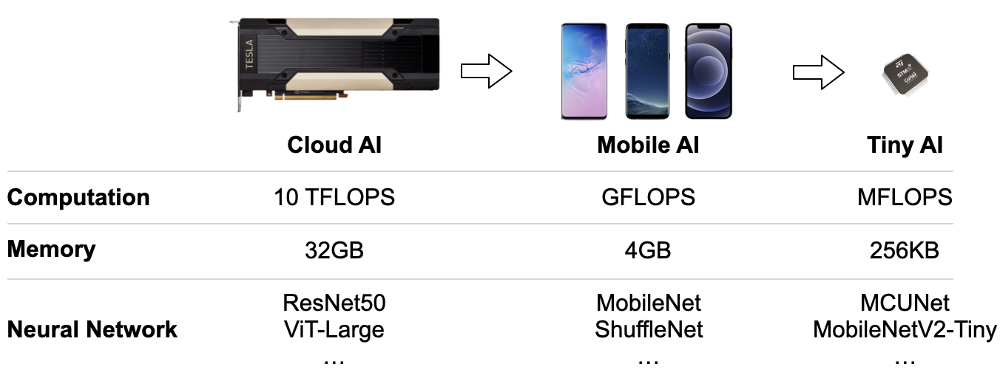
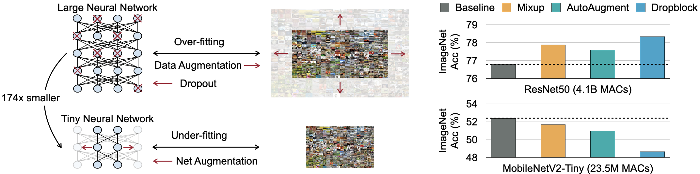
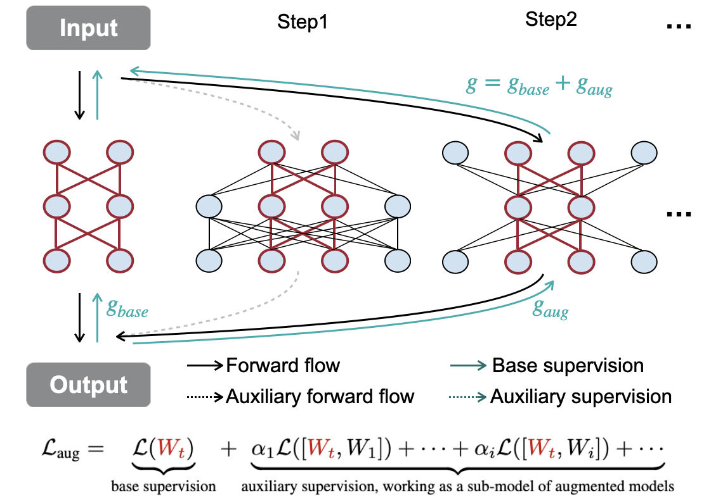
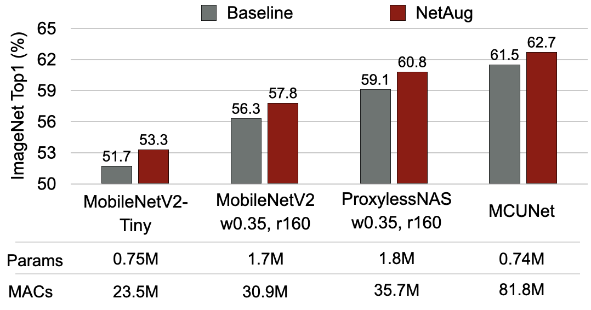
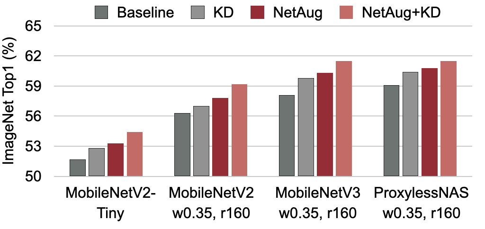
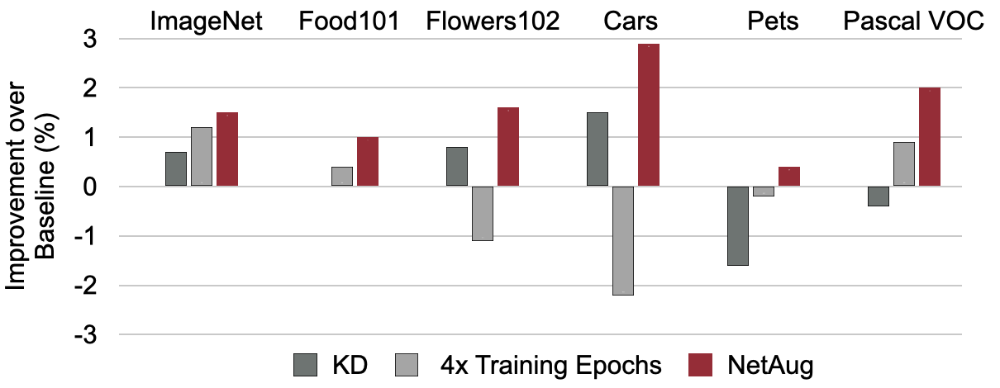

# Network Augmentation for Tiny Deep Learning

```BibTex
@inproceedings{
    cai2022network,
    title={Network Augmentation for Tiny Deep Learning},
    author={Han Cai and Chuang Gan and Ji Lin and Song Han},
    booktitle={International Conference on Learning Representations},
    year={2022},
    url={https://openreview.net/forum?id=TYw3-OlrRm-}
}
```

### Neural Networks Going Tiny for Deployment on Tiny Edge Devices
<p align="center">
    
</p>

### Training Tiny Neural Networks is Different from Training Large Neural Networks
<p align="center">
    
</p>

### Augment Tiny Neural Networks to Get More Supervision During Training
<p align="center">
    
</p>

### Experiment Results
<p align="center">
    
</p>
<p align="center">
    
</p>
<p align="center">
    
</p>

## Environment
* Python 3.8.5
* Pytorch 1.8.2
* [torchpack](https://github.com/zhijian-liu/torchpack)
* [torchprofile](https://github.com/zhijian-liu/torchprofile)

## Pretrained Models
| Model                                      | #Params | #MACs | ImageNet Top1 (%) | Pretrained weights                                                                        | 
|--------------------------------------------|---------|-------|-------------------|-------------------------------------------------------------------------------------------| 
| MobileNetV2-Tiny + NetAug                  | 0.75M   | 23.5M | 53.3%             | [pth](https://drive.google.com/file/d/1rTJQXMO2A9PzzY3Vo9MvaB7_m58H4RIX/view?usp=sharing) | 
| MCUNet + NetAug                            | 0.74M   | 81.8M | 62.7%             | [pth](https://drive.google.com/file/d/12w2EoPKmHhTqz0yMwld7u766WJOCPfAn/view?usp=sharing) | 
| ProxylessNAS-Mobile (w0.35, r160) + NetAug | 1.8M    | 35.7M | 60.8%             | [pth](https://drive.google.com/file/d/1fd9YDVlx6oFC8spoeeM5NtMMLQaWExFP/view?usp=sharing) |

More are available on [Google Drive](https://drive.google.com/drive/folders/1wquOwniMCI9iDftaiPmdzxwkE8o_ES72?usp=sharing). 

To evaluate pretrained models, please run **eval.py**.

Example:
```
torchpack dist-run -np 1 python eval.py \
	--dataset imagenet --data_path /dataset/imagenet/ \
	--image_size 160 \
	--model proxylessnas-0.35 \
	--init_from <path_of_pretrained_weight>
```

## How to train models with NetAug
Scripts for training models with NetAug on ImageNet are available under the folder **bash/imagenet**.

Notes:
1. With netaug, the expand ratio of the augmented model will be very large. We find the **[fout](https://github.com/mit-han-lab/once-for-all/blob/4451593507b0f48a7854763adfe7785705abdd78/ofa/utils/my_modules.py#L122)** initialization strategy does not work well for such kind of models. Thus, we use **[nn.init.kaiming_uniform](https://github.com/pytorch/pytorch/blob/e0495a7aa104471d95dc85a1b8f6473fbcc427a8/torch/nn/modules/conv.py#L114)** initialization when netaug is used. 
2. We sort the channels according to the channel's L1 value at the beginning of each epoch, which forces the target model to take the most important channels.
3. We stop augmenting the width multiplier (i.e., width multiplier augmentation ratio is always 1.0) in the second half of the training epochs, which slightly improves the results in our early experiments. 
4. When using netaug, running mean and running var in BN layers are not accurate. Thus, if netaug is used, we always use a subset of training images to re-estimate running mean and running var in BN layers after getting the trained model. 

## How to run transfer learning experiments
To run transfer learning experiments, please first download our pretrained weights or train the models on the pretraining dataset by yourself. Scripts are available under the folder **bash/transfer/**.

## Related Projects

[TinyTL: Reduce Activations, Not Trainable Parameters for Efficient On-Device Learning](https://github.com/mit-han-lab/tinyml/tree/master/tinytl) (NeurIPS'20)

[MCUNet: Tiny Deep Learning on IoT Devices](https://arxiv.org/abs/2007.10319) (NeurIPS'20, spotlight)

[Once for All: Train One Network and Specialize it for Efficient Deployment](https://arxiv.org/abs/1908.09791) (ICLR'20)

[ProxylessNAS: Direct Neural Architecture Search on Target Task and Hardware](https://arxiv.org/pdf/1812.00332.pdf) (ICLR'19)
